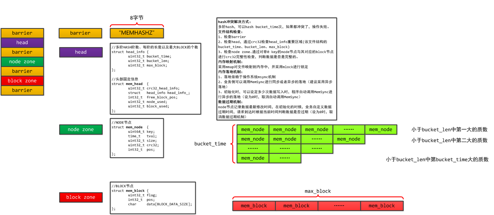
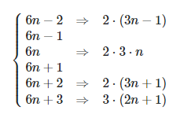

#   shm_hashtable 基于共享内存的多阶hashtable

实现了一种在共享内存中存取数据的hash表，它采用了多级存储求模取余的方法

##	

##  Why 共享内存
在服务进程因某种原因挂掉的时候，共享内存中的数据仍然存在，相对于内存有优势 
注意：在共享内存中的数据结构一定要是连续的，最好不要使用指针成员

## Why 多阶
性能+空间利用率，阶数=100的时候空间利用率可以达到95%以上

## 生成连续素数的筛法
6N±1定侓：任何一个自然数，总是可以表示成如下的形式之一：6N,6N+1,6N+2,6N+3,6N+4,6N+5 (N=0,1,2,3…) 显然，当N>=1时，6N,6N+2,6N+3,6N+4都不是素数，只有形如6N+1和6N+5的自然数有可能是素数（注意：这只是过滤出有可能的数，但未必一定是，比如25=6*4+1，就不是素数）。6N+5又可以表示成6N-1，所以，除了2和3外，所有的素数都可以表示成6n±1的形式。 

### 筛选过滤
[6n1-and-6n-1-prime-format](https://math.stackexchange.com/questions/895992/6n1-and-6n-1-prime-format)

